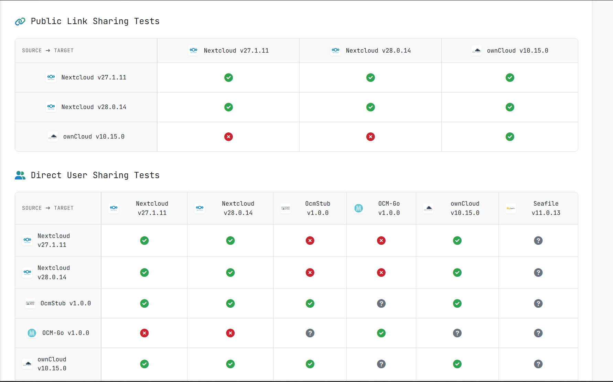
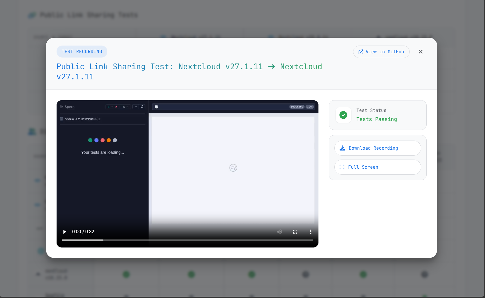
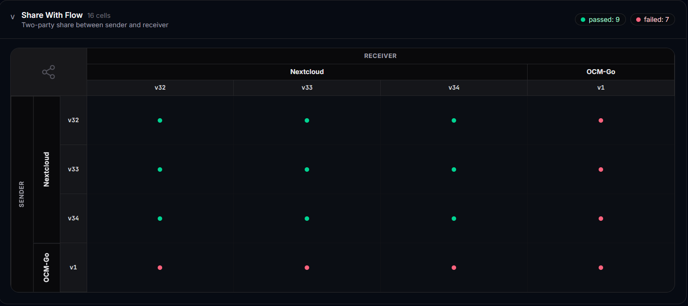
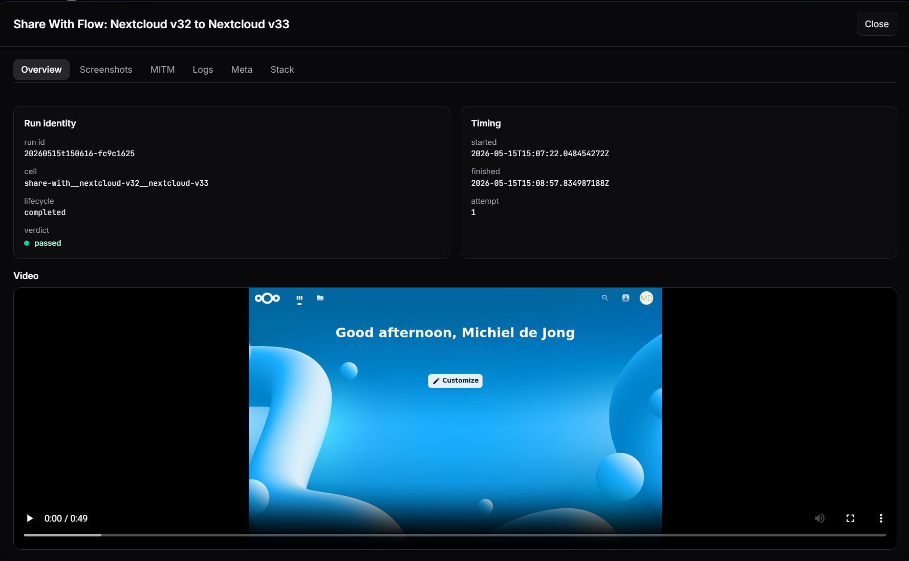
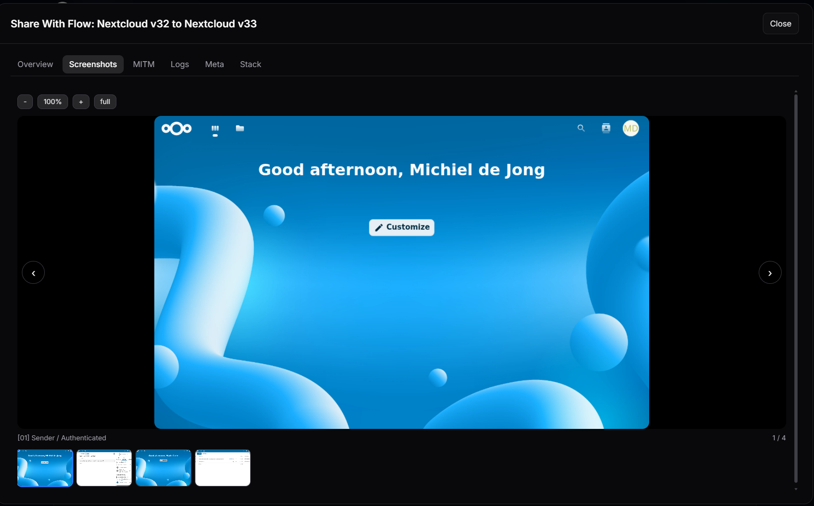
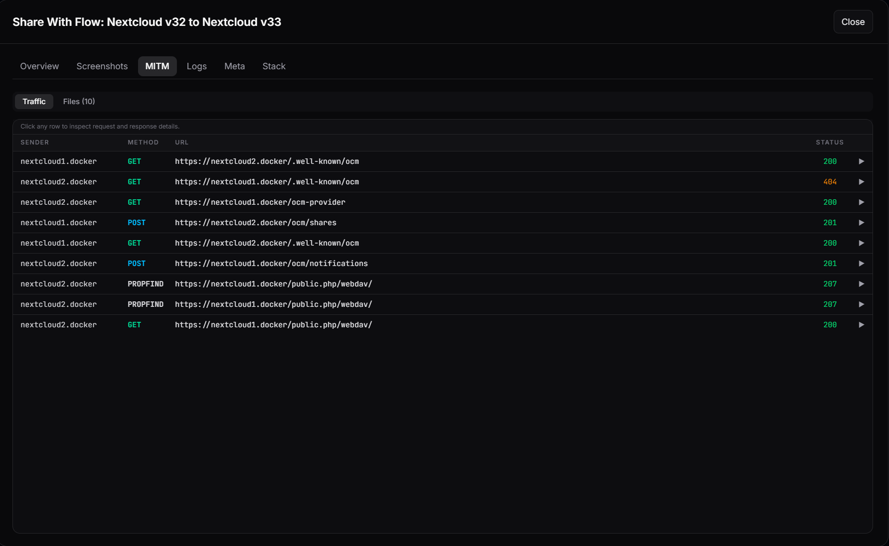
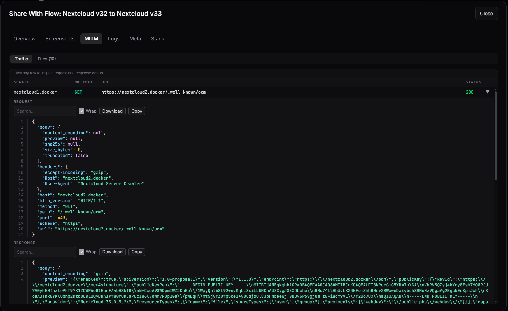
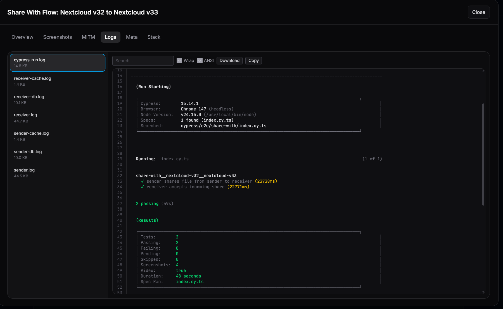
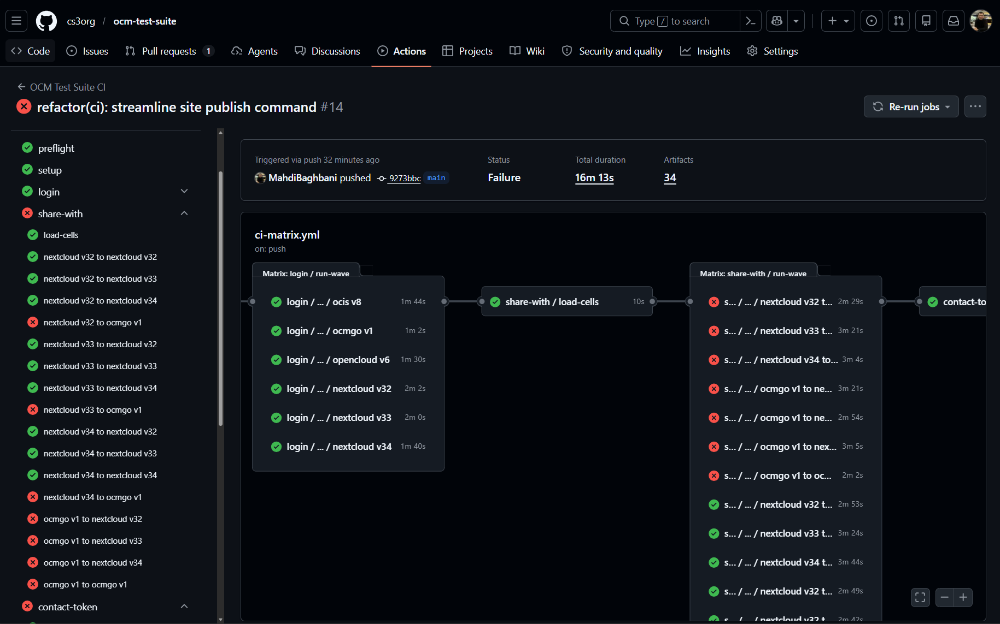

## Milestone report: Structured logging for test suite (M7)

This report covers the work carried out for Milestone M7 of the OCM-STA
project. The milestone focuses on structured logging and artifact handling in
the OCM test suite, with the goal of making CI runs easier to review through
per-platform outputs, job summaries, and the published results site.

Milestone M7 is tracked in [cs3org/OCM-STA#17][sta-17]. The public record for
the work includes a merged containers pull request for the platform image line,
a merged ocm-test-suite pull request for the new harness and structured
artifacts, and a recent GitHub Actions run that shows the resulting
artifact and Pages publication flow.

The contractual milestone deadline in the upstream milestone list is
2026-04-30.

## Executive summary

Milestone M7 improves how OCM test-suite runs are observed and reviewed. The
new flow produces per-cell artifacts, including logs and supporting material
for each platform pairing, together with an aggregated summary and a published
website view for reviewers who are not working directly inside the CI
environment.

The report references the merged implementation pull requests and a recent CI
run that produced the artifact set and Pages bundle. Some matrix cells in that
run failed, so the run is included as a useful view of the logging and
reporting surface rather than as a pass/fail statement about protocol
behavior.

## Contractual milestone definition

According to the project milestone list, Milestone M7 is defined as:

- Milestone M7: Structured logging for test suite
  - Implement JSON logs per platform, artefact upload
  - Implement Log viewer in CI job summary

Deadline: 2026-04-30

## Work performed

### 1. Milestone tracker and coordination

- **[cs3org/OCM-STA#17][sta-17]** - Implement JSON logs per platform, artefact
  upload
  - Serves as the milestone tracking entry point.
  - Links the public pull requests described below and references the website
    repository used for publishing.

### 2. OCM test suite structured artifacts and CI integration

- **[cs3org/ocm-test-suite#217][ocmts-217]** (merged)
  - Introduced a Nushell-driven control plane ("ocmts") that owns matrix
    planning, service orchestration, Cypress execution, artifact collection,
    and suite aggregation.
  - Added per-cell artifacts and aggregation outputs intended for CI
    consumption, together with the publishing wiring needed to build a Pages
    bundle.

### 3. Containers and platform prerequisites

- **[MahdiBaghbani/containers#3][containers-3]** (merged)
  - Added the milestone container line needed for the M7 test-suite slice,
    including Firefox and mitmproxy images and the OpenCloud and oCIS image
    line.
  - This enables consistent CI execution and artifact generation across the
    platform matrix.

### 4. CI run and published site

- **[GitHub Actions run 25924987426][run-14]** (completed, conclusion: failure)
  - Produced per-cell artifacts (for example `cell-login-*`,
    `cell-share-with-*`, `cell-contact-token-*`, `cell-contact-wayf-*`) and an
    `aggregate-summary` artifact, plus a `github-pages` artifact.
  - The run is useful for reviewing how the updated suite exposes logs,
    summaries, CI annotations, and uploaded artifacts, even though some test
    cells were still failing.
  - In this report, the run is used to illustrate the reporting and artifact
    surface. It is not presented as a protocol conformance pass/fail result.

- Published site: **[cs3org.github.io/ocm-test-suite][site]**

- Website repository reference: **[MahdiBaghbani/ocm-web-site][site-repo]**

## Website screenshots (before and after)

The following screenshots illustrate the change from the older matrix and test
detail views to the newer results pages, request-flow views, log views, and CI
run summary. They are included to make the reporting surface easier to review
visually.

### Before (previous website and test views)

The previous views provided a compact matrix and test detail page, but offered
less drill-down around request details, per-cell logs, and CI-produced
artifacts.

### After (current website and test views)

The updated views expose the matrix, test details, screenshots, request flow,
request details, logs, and the related CI run summary as separate review
surfaces.

## Results vs milestone goals

### Goal 1: Implement JSON logs per platform, artefact upload

The implementation work in **[cs3org/ocm-test-suite#217][ocmts-217]**
introduces per-cell artifacts and aggregation outputs intended for CI
consumption. These outputs give each matrix cell its own reviewable material,
including structured log outputs associated with the platform pairing instead
of only a global CI log. The referenced CI run **[GitHub Actions run
25924987426][run-14]** shows that a matrix run now produces per-cell artifacts
and an aggregated summary artifact, giving reviewers a clear place to inspect
the structured log and artifact upload path.

### Goal 2: Implement Log viewer in CI job summary

The CI integration in **[cs3org/ocm-test-suite#217][ocmts-217]** includes
workflow generation and publishing wiring. In **[GitHub Actions run
25924987426][run-14]**, the job summary and annotations give direct entry
points into the produced artifacts. The richer review surface is then provided
by the published results site, where the screenshots, request-flow views, and
log views can be inspected through **[cs3org.github.io/ocm-test-suite][site]**.

[sta-17]: https://github.com/cs3org/OCM-STA/issues/17
[ocmts-217]: https://github.com/cs3org/ocm-test-suite/pull/217
[containers-3]: https://github.com/MahdiBaghbani/containers/pull/3
[run-14]: https://github.com/cs3org/ocm-test-suite/actions/runs/25924987426
[site]: https://cs3org.github.io/ocm-test-suite/
[site-repo]: https://github.com/MahdiBaghbani/ocm-web-site
